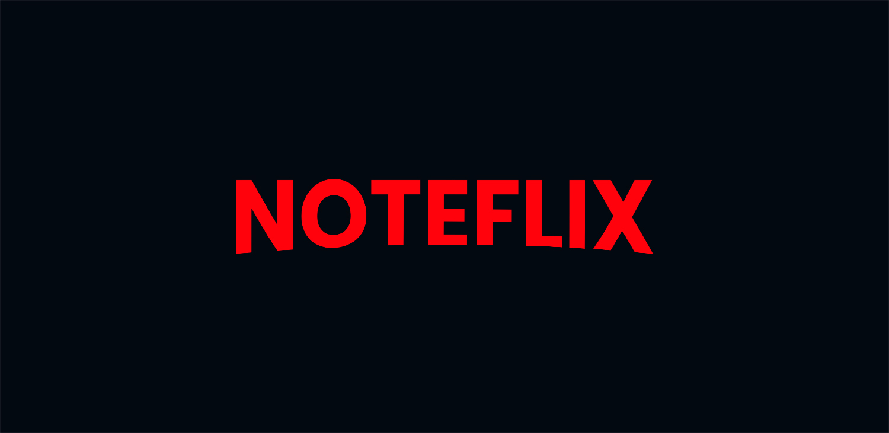

<div align="center">
  
  
  <h1>🎞️ Front End - Noteflix</h1>

  <p style="max-width: 460px;">O <b>Noteflix</b> visa facilitar a criação e visualização de notas de filmes. Com total liberdade criativa, os usuários podem personalizar suas notas adicionando título, descrição, avaliação e tags conforme suas preferências.</p>

  <a href="https://noteflix-web.vercel.app/" target="_blank"></a>
  
</div>

## 📖 Tabela de Conteudos
  <ul>
    <li><a href="#-features">✨ Features</a></li>
    <li><a href="#-demonstração">🚀 Demonstração</a></li>
    <li><a href="#-pré-requisitos">🔧 Pré-requisitos</a></li>
    <li><a href="#%EF%B8%8F-instalação">⚙️ Instalação</a></li>
    <li><a href="#-tecnologias-utilizadas">💻 Tecnologias utilizadas</a></li>
    <li><a href="#-autor">👨🏻‍💻 Autor</a></li>
    <li><a href="#-licença">📄 Licença</a></li>
  </ul>

## ✨ Features
- [x] Cadastro de usuário
- [x] Atualizar perfil de usuário
- [x] Cadastro de notas
- [x] Apresentação de notas
- [x] Remover notas

## 🚀 Demonstração
  <h3>Front End</h3>
  <a href="https://noteflix-web.vercel.app/" target="_blank"></a>
  <h3>Back End</h3>
  <a href="https://github.com/diogo-kappaun/noteflix-back"></a>
  
## 📃 Pré-requisitos
<p>Antes de começar, você vai precisar ter instalado em sua máquina as seguintes ferramentas:</p>
<a href="https://nodejs.org/en/download"></a>
<p><b>Versão: v18.0.0+</b></p>
<a href=""></a>
<p><b>Versão: v8.0.0+</b></p>

## 🛠️ Instalação
1. Clone o repositório:
```bash
git clone https://github.com/diogo-kappaun/noteflix
```
2. Vá até o repositório clonado:
```bash
cd noteflix-web
```
3. Instale as dependências:
```bash
npm install
```
4. Execute o app:
```bash
npm run dev
```

## 💻 Tecnologias utilizadas
<p><a href="https://developer.mozilla.org/pt-BR/docs/Web/JavaScript"></a></p>
<p><a href="https://react.dev/"></a></p>
<p><a href="https://tailwindcss.com/"></a></p>
<p><a href="https://www.radix-ui.com/"></a></p>
<p><a href="https://axios-http.com/ptbr/"></a></p>
<p><a href="https://vitejs.dev/"></a></p>

## 👨🏻‍💻 Autor

<a href="https://github.com/diogo-kappaun">
 
 <br />
 <sub><b>Diogo Kappaun</b></sub>
</a>


Feito com ❤️ por Diogo Kappaun 👋🏽 Entre em contato!

[](https://www.instagram.com/eu.diogokappaun/) [](https://www.linkedin.com/in/diogo-kappaun-2070b2265/) 
[](mailto:diogohkappaun@gmail.com)

## 📄 Licença

Este projeto é licenciado sob os termos da Licença MIT. A Licença MIT é uma licença de código aberto que permite o uso, modificação, distribuição e venda do software, sujeito a certas condições. Consulte o arquivo <b>LICENSE</b> para mais detalhes.
